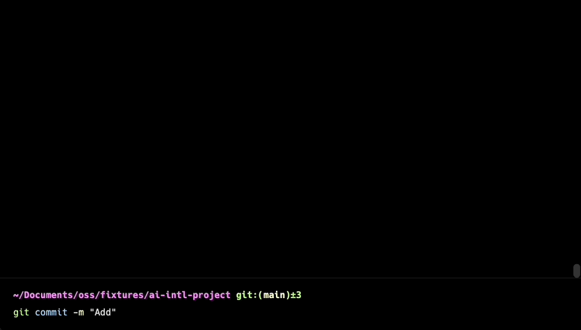
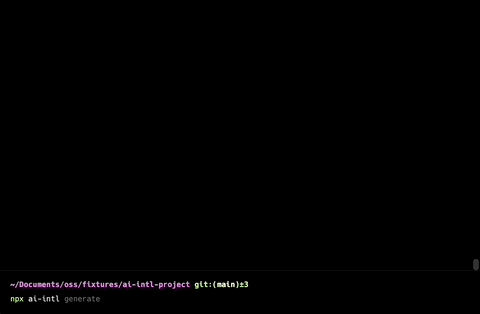

<div align="center">
  <div>
    
    <h1 align="center">AI-Intl</h1>
  </div>
	<p>A CLI that manage your translations for you with AI 🚀</p>
	<a href="https://www.npmjs.com/package/ai-intl"></a>
   <br>
   <a href="https://www.producthunt.com/posts/ai-intl?utm_source=badge-featured&utm_medium=badge&utm_souce=badge-ai&#0045;intl" target="_blank"></a>
</div>

</br>

> Language barriers have always been a major obstacle in the globalized world we live in. With businesses expanding overseas and people from different cultures interacting, the need for effective translation services has never been greater. However, traditional translation methods are often time-consuming, costly, and can still result in errors. That's where AI-Intl comes in

## What is all about?

Say goodbye to the complexities of internationalization with our AI-powered CLI application. This cutting-edge technology automates the process of translating and adapting your website for different cultures and languages, saving you time and effort.

## Setup

> Please note that this project is currently under active development, so while it may not work 100% at this time, we are working diligently to improve it. Thank you for your patience and understanding.

1. Install ai-intl CLI:

   ```sh
   npm install -g ai-intl
   ```

2. Retrieve your API key from [OpenAI](https://platform.openai.com/account/api-keys)

   > If you haven't already, you'll have to create an account and set up billing.

3. Set the key so ai-intl can use it:

   ```sh
   ai-intl config set OPENAI_KEY=<your token>
   ```

4. Generate the config file:

   ```sh
   ai-intl generate
   ```

   

5. Customize your translations

   > Open _ai-intl.config.json_ that the CLI generated for you and customize your translations.

6. _Optional_ if you want to run ai-intl pre-commit set up the hook.

   ```sh
   ai-intl hook install
   ```

   If you are using husky add <code>npx ai-intl</code> to the pre-commit hook.

## How it works

- CLI that generate for you translations on demand. Run <code>ai-intl translate</code> and it will translate the content for you.
- If enabled, the pre-commit hook 🚀 will check for translation changes in your default locale and adapt all other translations for each pull request.
- Custom prompts, you can customize your translations by using a _custom_ propmt, just type <code>ai-intl translate --prompt "your prompt" </code>

## Issues

- If you are facing any issue, please feel free to open a GitHub issue.

## Advantages

After finishing development, translation of content becomes a breeze with AI to take care of it all. With the added convenience of instant checks for corner cases such as right-to-left language or long words, you can rest easy knowing that your content is being handled with efficiency and care, leaving you with more time to focus on other important tasks

Website that need to support multiple locales
Startup that is building awesome products and you want to focus on things that matters
Work on marketing materials
You need localization of social media platforms
You are running and e-commerce platform
You want to add internalization for your software

## Use cases:

:white_check_mark: Building a website that supports multiple locales

:white_check_mark: Focus on product opportunity and don't want to waste time dealing with json files

:white_check_mark: Working on marketing materials

:white_check_mark: Localizing social media platforms

:white_check_mark: Running an e-commerce platform

:white_check_mark: Adding internationalization to software

### Maintainers

- **Erik Olivero**: [@ekolivero](https://github.com/erik18xk)

### Used by

- [jobtome](https://us.p3.jobtome.com)
